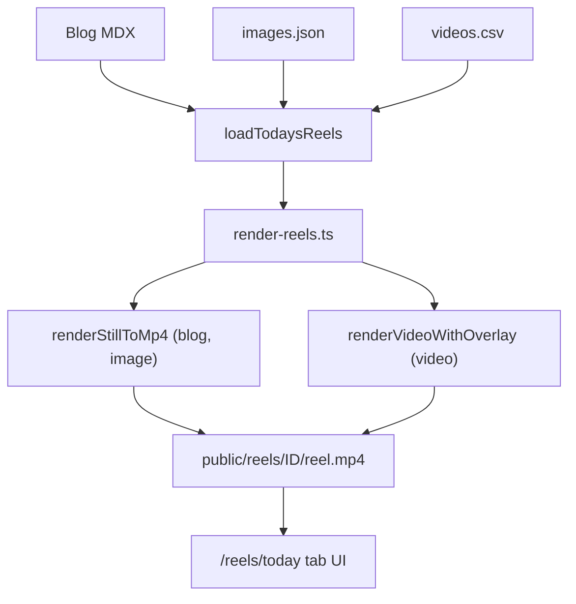

## 1. The problem: posting daily without burning out

Lingu.Africa sells bilingual books for African diaspora families. The product is niche, the audience is scattered across Europe and North America, and the most reliable way to reach them is short-form video — TikTok and Instagram Reels. One post per day, consistently, over months.

The math on doing that manually is brutal. Finding a cover image, opening a design tool, compositing hook text, exporting at 9:16, copying a caption, uploading — that is twenty to thirty minutes of repetitive work every single day. Miss one day and the streak breaks. Do it for a month and it starts to feel like a second job.

I wanted to reduce daily friction to this: open a URL, pick a tab, tap download.

The result is a static video factory — a nightly script that reads content files, composites frames, runs ffmpeg, and commits the output. No cloud transcoding, no dashboard, no third-party video tool. Just files, a scheduler, and a Next.js page at `/reels/today`.

---

## 2. Three content types, one pipeline

The platform needs three different kinds of reels because each serves a different purpose.

**Blog reel.** Every blog post on Lingu.Africa already has a cover image and a `reelHook` in its frontmatter. When a post is scheduled for today, it becomes a reel automatically — no extra authoring step. The cover is converted from landscape to vertical (blurred full-bleed background, sharp foreground centered below the hook zone), the hook text is composited on top, and the whole thing loops for a few seconds with a subtle zoom.

**Image reel.** A separate weekly narrative arc — five hooks about diaspora parenting, each paired with a detailed AI image prompt. The prompt specifies art style (soft storybook illustration), emotional register (warm, not dramatic), vertical 9:16 composition, and negative space at the top for the hook overlay. These are scheduled in `content/reels/images.json`, one entry per day.

**Video reel.** Three base clips (A, B, C) recorded once. Every day a row in `content/reels/videos.csv` picks one of the three and supplies a new hook and caption. The hook is overlaid on the existing footage; the rest of the clip is untouched. Only the text changes.

The format choice for each source type was deliberate. The video schedule is a spreadsheet-friendly semicolon CSV — one short row per day, easy to edit in any text editor or export from Google Sheets:

```
date;hook;caption;video_type
2026/6/20;Kirundi helps children feel closer to family.;Language is the bridge between your child and everyone they love.;A
```

The image schedule is JSON because each entry has a three-hundred-word art-direction prompt. Multiline strings in CSV are painful. JSON handles them cleanly, and the file is append-only — adding a new week is a single array entry.

---

## 3. How the pipeline works

A single function, `loadTodaysReels()`, reads all three sources and returns a normalized `Reel[]` array. Each reel carries its type, hook lines, caption, and source-specific fields (cover path, image prompt, or base video path). The function checks whether a rendered MP4 already exists so the studio page can show the right state without running ffmpeg.

```typescript
export async function loadTodaysReels(dateOverride?: string): Promise<Reel[]> {
  const today = dateOverride ?? todayParis();
  const [blog, imageReels, video] = await Promise.all([
    loadBlogReel(today),
    loadImageReels(today),
    loadVideoReel(today),
  ]);
  return [blog, ...imageReels, video].filter((r): r is Reel => r !== null);
}
```

The render script dispatches on `reel.type`:

```typescript
switch (reel.type) {
  case "blog":  await renderBlogReel(reel, outDir); break;
  case "image": await renderImageReel(reel, outDir, force); break;
  case "video": await renderVideoReel(reel, outDir); break;
}
```

Blog and image reels end up as a composited PNG that gets looped into an MP4 with a Ken Burns zoom. Video reels overlay a transparent hook PNG onto moving footage. The ffmpeg paths are different but they share the same output contract: `public/reels/{id}/reel.mp4` and `public/reels/{id}/caption.txt`, both at 1080×1920 in H.264 `yuv420p`.

Before each run, the entire `public/reels/` directory is wiped. Only today's artifacts exist on disk after the script finishes.



Hook text is rendered with `@napi-rs/canvas` rather than ffmpeg's `drawtext` filter. Canvas gives exact pill widths via `measureText()`, clean rounded rectangles, and the same code path for both full-frame compositing and transparent overlay. Duration is calculated automatically from pill count: `5s + 1.5s × pills`. Longer hooks get more time on screen.

---

## 4. The AI image decision: prompts as code

The image reel type uses OpenRouter's chat completions API with `modalities: ["image", "text"]` to call Gemini image generation. The model returns a base64 PNG which gets decoded and written to disk.

The interesting part is not the API call — it is twelve lines of `fetch`. The interesting part is the prompt.

Here is an excerpt from one entry in `images.json`:

```
Soft modern storybook illustration of an African diaspora family having dinner
in a cozy apartment in Europe or North America. The mother is speaking warmly
to her young child in their heritage language. The child understands, smiles,
but casually responds in English.

Vertical 9:16 composition for TikTok and Reels. Leave clean negative space
in the upper center for a quote overlay.

Avoid Pixar style, glossy rendering, hyper-realistic AI look, anime style,
dramatic expressions, or any text, letters, words, captions, signs, or writing
anywhere in the image.
```

The no-text instruction matters. Without it, the model would hallucinate words on the dinner table, on a calendar on the wall, or on a book spine — misspelled, in the wrong language, unreadable. The hook text is rendered separately via Canvas for brand consistency. The image prompt's only job is the background.

Images are generated once and cached at `content/reels/{date}-image.png`. Re-running `npm run reel:today` reads the cache. Pass `--force` to regenerate. This means prompt tweaks and hook edits never re-bill the API, and a bad generation can be replaced without re-rendering everything.

The model is configurable via `OPENROUTER_IMAGE_MODEL`. The API key already existed in `.env.local` for the chat feature. Zero new infrastructure.

---

## 5. The boring parts that made it reliable

The AI image generation is the most visible piece. The parts that made the whole system actually run are less interesting to describe and more important to get right.

**Timezone alignment.** `todayParis()` uses `Europe/Paris` via `toLocaleDateString("en-CA")`. The nightly GitHub Action has two crons — `10 23 * * *` (winter, CET) and `10 22 * * *` (summer, CEST) — so the wall-clock trigger is always 00:10 Paris regardless of DST. Content scheduling and CI are on the same clock. Without this, a post scheduled for June 20 might render on June 19 or June 21 depending on time of year.

**Fail fast, fail loudly.** Every error condition prints a specific, human-readable message and exits with code 1. Missing ffmpeg: `"ffmpeg is not installed. Install with: brew install ffmpeg"`. Missing cover image: `"Cover image not found: /path/to/file"`. Missing API key: `"OPENROUTER_API_KEY is not set"`. The script never silently skips a step or defaults to empty output. If something is wrong, CI goes red immediately.

**The studio page is internal tooling.** `/reels/today` is `noindex`, `force-dynamic`, and behind no auth — it is just a URL I open on my phone. The Next.js page is a server component that calls `loadTodaysReels()` directly; no API route needed. The share/download buttons use the Web Share API with file support, so I can hand a video directly to TikTok or Instagram from my phone's native share sheet in one tap.

**Placeholder credentials in CI.** The nightly workflow runs `next build`. The build loads API route files that construct SDK clients (Stripe, Supabase) — even though those routes are never called during a static build. Without environment variables, the build crashes. The workflow sets `STRIPE_SECRET_KEY=sk_test_build_placeholder_not_used_in_this_workflow_00`. Ugly but effective. It took one CI failure to find this; now it is documented in the workflow file.

---

## 6. What I would do differently

Honest assessment for anyone considering a similar build.

The image PNG cache (`{date}-image.png`) lives in `content/reels/` — the source tree. That means it can accidentally get committed. A single `.gitignore` entry for `www/content/reels/*-image.png` would prevent this. I have not added it yet.

There is no `--date` CLI flag. Testing a specific day means passing a `dateOverride` string in code. This is fine for quick checks but annoying enough that I will eventually add `--date 2026-06-22` to the CLI argument parser.

The `render-pilot.ts` debug script predates the new pipeline and still partially duplicates the ffmpeg logic. After the refactor it imports from `render-core.ts`, but it should eventually just be a thin wrapper around the main dispatcher with a single-reel scope flag.

---

## Closing

Any solo builder with a content-heavy product faces the same daily posting grind. The usual solutions are either manual (unsustainable) or a paid SaaS tool (another dependency, another bill, another login).

A static video factory like this one — git-backed content files, nightly CI, no cloud transcoding bill, runs in under a minute on GitHub-hosted runners — is cheap to build and free to run. The hard part is not the code. It is deciding that the repetitive work is worth automating at all, then committing to the boring infrastructure choices that make it run every night without your attention.

The PR for this feature is [here](https://github.com/lionel-k/lingu_africa/pull/345). The content files and scripts are all in the open.
